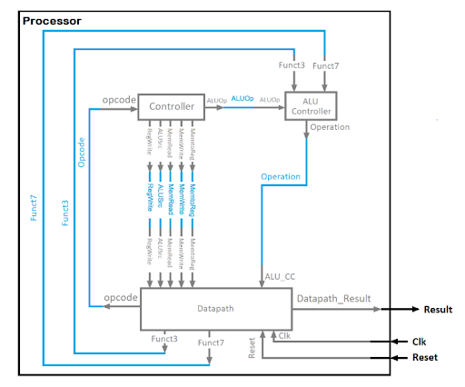
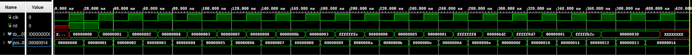

# 32-bit Single-Cycle RISC-V Processor (RV32I)

## Overview
This project is a structural Verilog implementation of a 32-bit Single-Cycle processor based on the RISC-V Instruction Set Architecture (RV32I subset). The design features a modular Datapath, a dedicated Control Unit, and a custom Arithmetic Logic Unit (ALU), all verified against a comprehensive test suite.

The core is designed to execute instructions in a single clock cycle, integrating instruction fetching, decoding, execution, and write-back stages into a unified architecture.

## Architecture & Modules

### 1. Processor Core
The top-level `Processor` module integrates the Controller and Datapath. It operates on a single-cycle timing model, taking `clk` and `reset` as inputs and outputting the final 32-bit `Result`.

### 2. Control Unit
The Control Unit is split into two specialized modules to handle instruction decoding:
* **Main Controller:** Decodes the 7-bit `Opcode` from the instruction memory to generate control signals for the Datapath, including `ALUSrc`, `MemtoReg`, `RegWrite`, `MemRead`, and `MemWrite`.
* **ALU Controller:** Generates the 4-bit `Operation` signal for the ALU by analyzing the `ALUOp` from the main controller alongside `Funct3` and `Funct7` fields from the instruction.

### 3. Datapath
The Datapath manages data flow between the processor's sub-modules. Key components include:
* **ALU (Arithmetic Logic Unit):** A 32-bit unit capable of signed addition, subtraction, logical operations (AND, OR, NOR), and Set-Less-Than (SLT) comparisons. It outputs status flags for `Zero` (equality) and `Overflow`.
* **Register File:** A bank of 32 32-bit registers (`x0`-`x31`) with two read ports and one write port, allowing for simultaneous operand retrieval.
* **Immediate Generator:** Extracts and sign-extends immediate values from instruction fields to provide operands for ALU or memory operations.
* **Program Counter (PC):** Utilizes a D Flip-Flop with asynchronous reset to maintain and update the current instruction address.

### 4. Memory System
* **Instruction Memory:** A byte-addressable memory initialized with a program ROM (64 entries). It outputs the 32-bit instruction corresponding to the current PC value.
* **Data Memory:** A 128-entry x 32-bit storage unit for runtime data manipulation. It supports read/write operations controlled by `MemRead` and `MemWrite` signals.

## Supported Instruction Subset
The processor implements a subset of the RV32I ISA, including:
* **Arithmetic:** `ADD`, `SUB`, `ADDI`
* **Logical:** `AND`, `OR`, `NOR` (via logic), `ANDI`, `ORI`
* **Data Transfer:** `LW` (Load Word), `SW` (Store Word)
* **Branching:** `BEQ` (Branch if Equal), `SLT` (Set Less Than)

## Verification
The design was verified using a custom Verilog testbench (`tb_processor.v`).

* **Methodology:** The testbench executes a sequence of 20 distinct instructions, covering arithmetic corner cases, memory access, and branching logic.
* **Results:** The processor successfully passed all **20/20 test cases**, confirming correct instruction execution and signal timing.

*Figure 1: Top-level processor simulation. The `Result` bus (bottom green line) updates correctly on each clock cycle, executing a sequence of arithmetic and logical instructions (Add, Sub, And, Or, SLT).*

<strong>View Component-Level Waveforms (ALU & Memory)</strong>

### ALU Verification
Verified signed/unsigned addition, logical operations, and flag generation.

*Figure 2: ALU simulation showing control signals (0-7) triggering different operations and updating the Zero/Overflow flags.*

### Memory Verification
Verified read/write consistency in the data memory module.

*Figure 3: Memory module test showing data `38` being successfully written and retrieved on the clock edge.*

## Tools Used
* **Language:** Verilog HDL
* **IDE / Simulation:** Xilinx Vivado
* **Waveform Analysis:** Vivado Simulator